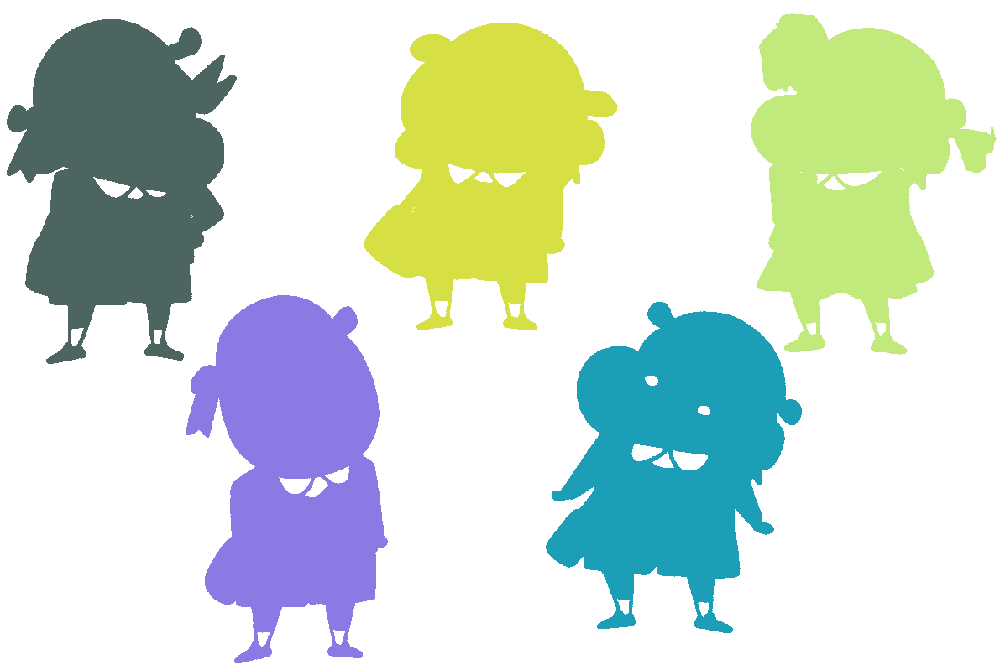
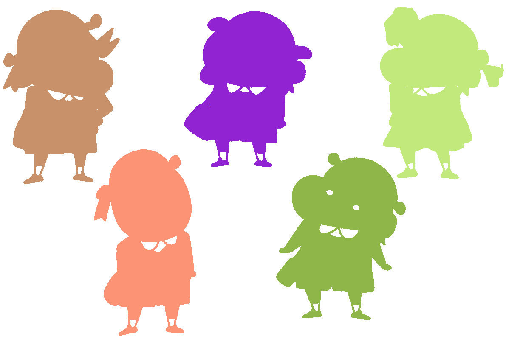
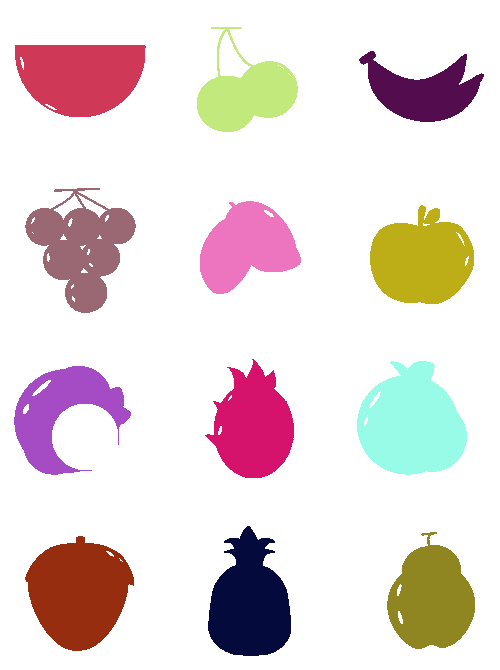
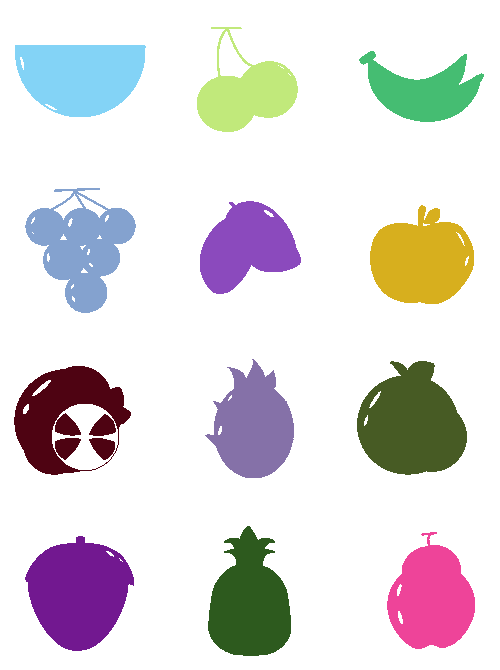
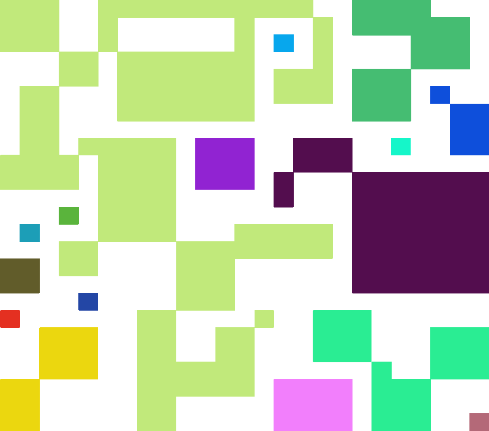

# CV HW2
#### 蕭耕宏 110590005

## 1. Problem Description
Component Labeling
Convert the color image to a binary image. Labeling components using 4-connected and 8-connected. Output color image.

## 2. Implementation
The main part of this code is four-neighbors traversal, eight-neighbors traversal and general image processing.

The function four-neighbors consider the top and left pixel of the current pixel. If the pixel is not the background, it will be labeled according to the condition. 

The function eight-neighbors consider the top, left, top-left, top-right pixel of the current pixel. If the pixel is not the background, it will be labeled according to the condition. One thing to note is that the top-right pixel could be out of bounds, so we need to check if it is in the image.

After the labeling process, we need to check the equivalence of the labels. **defaultdict** from **collections** is used to store the equivalence of the labels. DFS is implemented to group the equivalent labels. After grouping, we can reassign the labels to the image.

In addition, noise removal is implemented. If the size of the label is smaller than the threshold, it will be removed.

The last step is to output the color image. We need to assign a color to each label. **pixel_color** function is used to assign a random color to each label. 

## 3. Results
### 1-4-connected

### 1-8-connected

### 2-4-connected

### 2-8-connected

### 3-4-connected

### 3-8-connected

### 4-4-connected

### 4-8-connected

