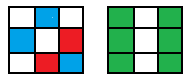
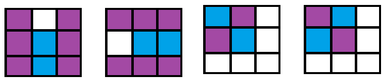
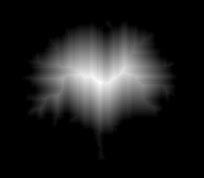
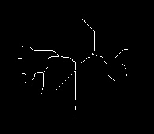
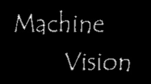
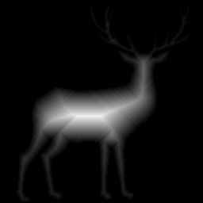
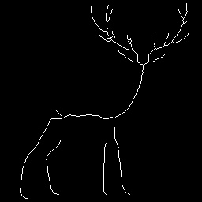
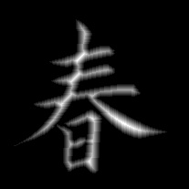
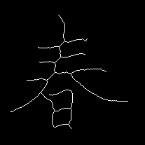

# Component Labeling with Image Processing
#### 蕭耕宏 110590005

## 1. Problem Description
The task mainly involves four-distance transform and medial axis transform. The goal is to implement a four-distance transform algorithm and a medial axis transform algorithm to extract the skeleton of the binary image. The skeleton is a set of pixels that can represent the shape of the object in the binary image. The skeleton can be used for further analysis, such as shape matching, object recognition, etc. 

## 2. Implementation Overview
The implementation involves several key steps:

### 2.1. Binary Image Conversion
The color image is converted into a binary image using a weighted combination of RGB channels and a thresholding technique.

### 2.2. Closing and Opening
Operations for noise reduction and smoothing of boundaries. This process only involving in the first example image because the other images are already clean. 

### 2.2. Distance Transform
Calculates the distance of each pixel to the nearest zero-valued pixel, useful for further analysis. In this implementation, the four-distance transform is used to calculate the distance of each pixel in order to extract the skeleton of the binary image later.

### 2.3. Medial Axis Transform 

Medial Axis Transform is implemented by two steps:
1. Find the local maxima of the distance transform image.
2. Remove redundant pixels to extract the skeleton of the binary image.

In the first step, the **local maxima** are found by comparing the distance of each pixel with its neighbors. Note that this process also considers the **critical pattern** that can break apart the skeleton once removed.

💡 An arrow-like pattern is crucial; removing its center pixel can cause the entire structure to collapse. This pattern is checked for 0, 90, 180, 270 degree. Blue pixels means 1 and red pixel means 0.

💡 Likewise, scattered pixels arranged in two parallel lines form another critical pattern. Removing the central pixel disrupts this arrangement significantly. This pattern is checkout for 0 and 90 degree. Two green line indicates the possible pixel positions.

In the second step, **redundant pixels** are removed to extract the skeleton of the binary image. In order to keep the skeleton eight-connected, the algorithm checks the neighbors of each pixel and removes the redundant pixels.

Redundant pixels are removed by matching the pattern of the pixel with its neighbors. If the pattern matches, the pixel is removed. 
Blue pixels means 1 and purple pixels means the pixel that might be removed.

### Image 1
#### 4-Connected distance transform

#### Medial Axis Transform

### Image 2
#### 4-Connected distance transform

#### Medial Axis Transform

### Image 3
#### 4-Connected distance transform

#### Medial Axis Transform

### Image 4
#### 4-Connected distance transform

#### Medial Axis Transform

