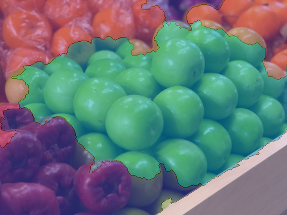
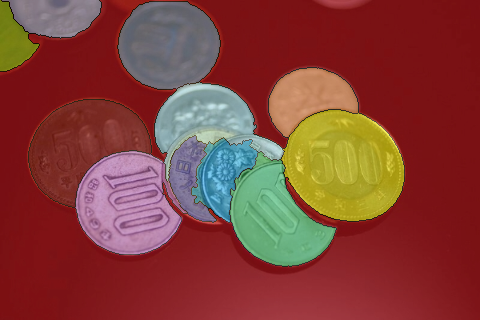
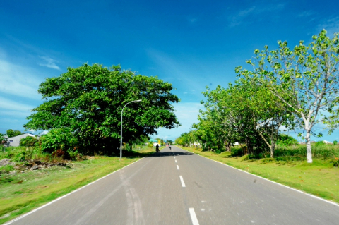

# Watershed Segmentation
#### 蕭耕宏 110590005

## 1. Problem Description
The task is to segment the image using the watershed algorithm. The idea of this implementation is to first mark the region user would like to segment and then use region growing to segment the image. 

## 2. Implementation Overview
The implementation involves several key steps:

### 2.1. retrive seeds
The user can mark the region to segment by drawing on the image using MS Paint. The implementation will then retrieve the seeds from the image. The seeds are the pixels that the user has drawn on the image. The seeds are used to segment the image using the watershed algorithm. The corresponding implementation funciton is `match_color` in `Processing` class.

### 2.2. put seeds into priority queue and mark them as being added to the queue
The pixels in priority queue should be the boundary pixels of the seeds. Those pixel are marked as `-2` in the label image and are put into the priority queue. The corresponding implementation funciton is `mark_boundary` in `Processing` class.

### 2.2. watershed_segmentation
The watershed algorithm is implemented in the `watershed_segmentation` function in `Processing` class. 
1. alive bar is used to visualize the progress of the algorithm.
2. a pixel is popped from the priority queue. It is then checked if it is a boundary pixel. If it is not, it is labeled as `-1` in the label image. If it is, it is labeled as the label of the seed in the label image. 

### 2.3. priority calculation
`get_priority` function in `Processing` class is used to calculate the priority of a pixel. The priority calculation involves the following:
1. mean_diff: the mean difference between the pixel and its neighboring seed group pixels.
2. variance_diff: the variance difference between the pixel and its neighboring seed group pixels.
3. edge_priority: the edge priority of the pixel. The edge priority is calculated as the horizontal gradient and vertical gradient of sobel filter of the pixel. 

priority = np.sqrt(mean_diff @ mean_diff) * 4 + np.sqrt(variance_diff @ variance_diff) * 4 + edge_priority * 0.5

### 3. Key Notes
1. class `PriorityQueue` is implemented by heapq, provided by python.
2. class `NeighborGroup` is used to separate the four neighbor pixels to labeled and unlabeled group.
3. class `PixelGroup` is used to store the pixels of the same label as the group will grow in the region growing step. Pixel group is stored and its mean and variance are stored each time a pixel is labeled to bring down the time complexity of the calculation.

### Image 1
#### Original Image

#### watershed segmentation

### Image 2
#### Original Image

#### watershed segmentation

### Image 3
#### Original Image

#### watershed segmentation

