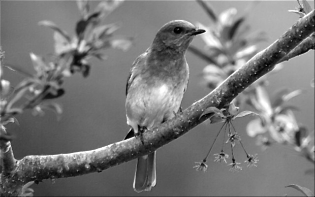
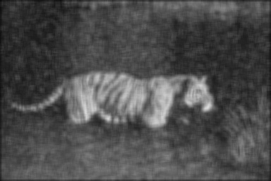
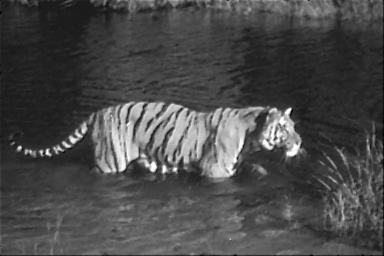
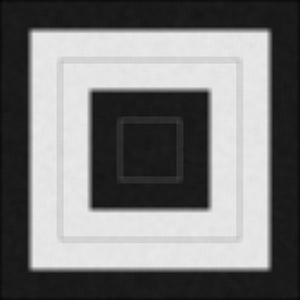
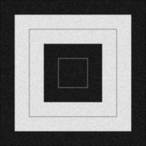
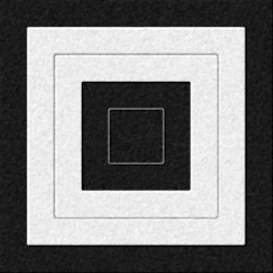

#  Image filtering
#### 蕭耕宏 110590005

## 1. Problem Description
1. Implement Mean Filter with 3x3 and 7x7 mask.
2. Implement Median Filter with 3x3 and 7x7 mask.
3. Implement Gaussian 2D Filter with 5x5 mask.
- Define your σ and describe your Gaussian kernel

## 2. Implementation Overview
The implementation involves several key steps:

### 2.1. Mean Filter
The mean filter is implemented by applying a convolution operation with a mask of 3x3 and 7x7.

### 2.2. Median Filter
The median filter is implemented by applying a convolution operation with a mask of 3x3 and 7x7.

### 2.3. Gaussian 2D Filter
The Gaussian 2D filter is implemented by applying a convolution operation with a mask of 5x5. The Gaussian kernel is defined as follows:
```python
def G(self, x, y, sigma):
    return np.exp(-((x**2 + y**2)/(2*sigma**2))) / (2*np.pi*sigma**2)

self.kernel = np.zeros((self.param, self.param))
    for i in range(self.param):
        for j in range(self.param):
            self.kernel[i, j] = self.G(i - self.param//2, j - self.param//2, self.sigma)
```
σ is set to 1 in `gaussian_filter_process` function.

### 2.4. Improvised Processing
Additionally, an improvised processing is implemented by applying a combination of multiple filters to the original image. As a result, sobel filter is implemented.

## 3. Results Comparison
The following images show the results of applying the mean filter, median filter, and Gaussian 2D filter to the original images.

The characteristics of each filter are as follows:
- The mean filter is effective in reducing noise, but it may blur the image.
- The median filter is effective in reducing noise, but it may cause salt-and-pepper noise.
- The Gaussian 2D filter is effective in reducing noise and preserving the edges of the image.

## 4. Improvised Processing
The improvised processing is implemented by applying a combination of the median filter, Gaussian 2D filter, and sobel filter to the original image. Below is some parameters of the filters:
- Median Filter: 3*3 mask
- Gaussian 2D Filter: 7*7 mask, σ=0.5
- Sobel Filter: x-direction and y-direction, mean squared of the two directions is weighted by 0.2 and added to the original image.

> The improvised processing is effective in reducing noise and preserving the edges of the image. 


### Image 1
#### Original Image


#### Mean Filter 3*3


#### Mean Filter 7*7


#### Median Filter 3*3


#### Median Filter 7*7


#### Gaussian 2D Filter 5*5


#### Improvised processing


### Image 2
#### Original Image


#### Mean Filter 3*3


#### Mean Filter 7*7


#### Median Filter 3*3


#### Median Filter 7*7


#### Gaussian 2D Filter 5*5


#### Improvised processing


### Image 3
#### Original Image


#### Mean Filter 3*3


#### Mean Filter 7*7


#### Median Filter 3*3


#### Median Filter 7*7


#### Gaussian 2D Filter 5*5


#### Improvised processing
