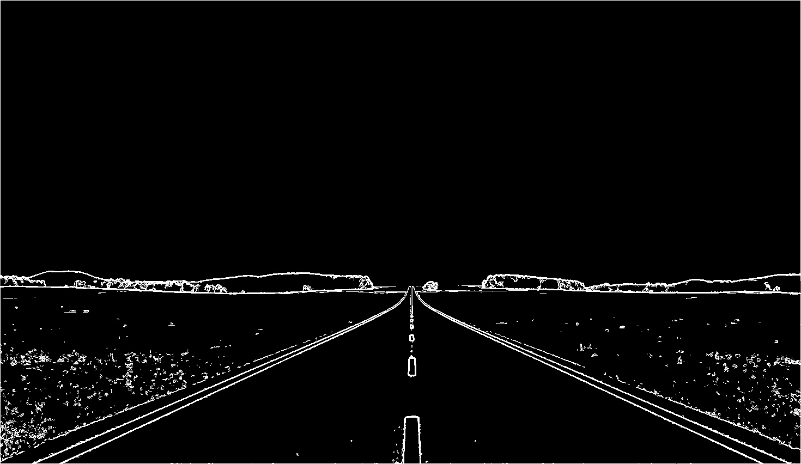
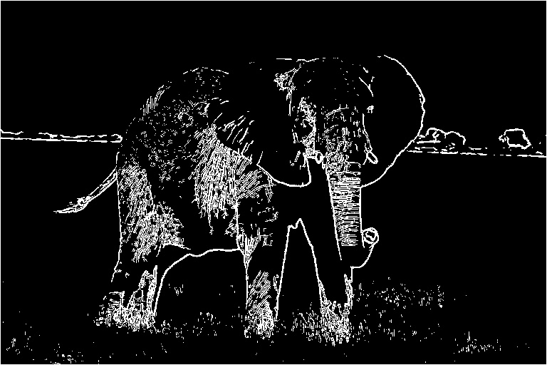
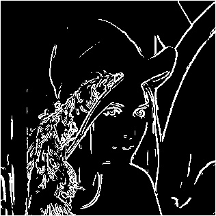

#  Image filtering

#### 蕭耕宏 110590005

## 1. Problem Description

This document provides a detailed explanation of the implementation for Homework 6, which focuses on Canny Edge Detection. The steps include noise reduction, finding the intensity gradient, non-maximum suppression, double threshold, and edge tracking by hysteresis.

## 2. Implementation Overview
The implementation involves several key steps:

### 2.1. Noise Reduction

Noise reduction is the first step in the Canny edge detection process. A Gaussian filter is used to smooth the image and remove noise. In this step, a Gaussian kernel is created and applied to each pixel in the image. The function `self.G` computes the Gaussian value.

### 2.2. Finding Intensity Gradient of the Image

The Sobel operator is used to find the intensity gradient of the image. This step calculates the gradient magnitude and direction.Here, the Sobel operator is applied to the image to compute the gradients in the x and y directions. The magnitude of the gradient is then calculated.

### 2.3. Non-maximum Suppression

Non-maximum suppression is used to thin out the edges. This step involves comparing each pixel with its neighbors and suppressing non-maximum values.

### 2.4. Double Threshold

Double thresholding is used to classify strong, weak, and non-relevant pixels. Pixels are classified based on the high and low threshold values.

### 2.5. Edge Tracking by Hysteresis

Edge tracking by hysteresis is used to finalize the edge detection by connecting weak edges to strong edges. This step ensures that weak edges connected to strong edges are preserved.

### Conclusion

The Canny edge detection process is implemented successfully. Each step of the process, from noise reduction to edge tracking by hysteresis, contributes to detecting edges accurately. This implementation demonstrates the effectiveness of the Canny edge detection algorithm in identifying edges in images.

### Image 1
#### Original Image

#### Canny Edge Detection

### Image 2
#### Original Image

#### Canny Edge Detection

### Image 3
#### Original Image

#### Canny Edge Detection
